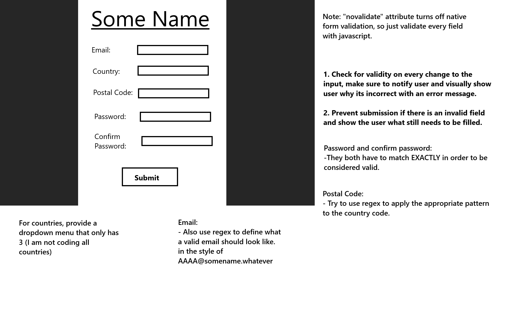

# Constraint Validation Practice:

This is for the constraint validation API practice in the advanced javascript portion of the full stack track. 

# Build a browser form 

Browser form requirements:

1. Collects the user's email, country, postal code, password, and password confirmation.

2. Use live inline validation to inform user whether a field is properly filled in or not.
Should use styling to highlight the field red and display an error message until it is filled in properly.

3. Should give an error if the submit button 
is pushed with any active errors or unfilled required fields.

4. form HTML element should have the "novalidate" attribute to allow all validation to be through the javascript files. Can still use HTML types.

5. If the form is submitted properly, give user a high five.

# drawn plan 

